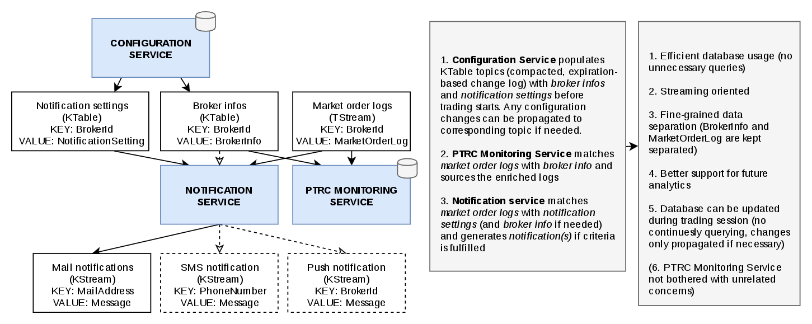

# PTRC - Notification playground

## Intro
This project is for building a `proof of concept` for the notification system approach for PTRC. (basic concept comes from [this solution](https://www.confluent.io/blog/real-time-financial-alerts-rabobank-apache-kafkas-streams-api/)).

We decided to use Java to implement any kind of Producer, Consumer and Streaming application. There are a lot of wrappers for Kafka but we decided to use Java since we expect all the features to be available in the Java version (since its implemented in Java).
Kafka ships with some command line tools to write/listen to Kafka topics (`<kafka_home>/bin/`). We have some convenient scripts, which cover the most use cases, in a different repository:
https://gitlab.jp.sbibits.com/ssd-fpga/ptrc-kafka-scripts

The basic idea is depicted in the following diagram:
  - 

### Input
As shown on the diagram, we want to consume a stream of `PTRC logs` (which are coming from the FPGA connector) and combine them with `notification settings` and `broker info` (maybe that will dense down to only broker info which contain the notif. settings, and/or maybe broker info will change to session info, this project's purpose is just to prove that the approach is a fitting solution).
The `broker info` and `notif. info` are loaded into a topic before consuming logs, so they are available without querying the database. These topics are so called compacted topics, which hold the most recent value of a topic entry based on a specified key ([read more about log compaction in Kafka](http://cloudurable.com/blog/kafka-architecture-log-compaction/index.html)). They can be seen as a in-memory table providing most recent information. While on the other hand the `log` topic is just a simple stream of data.

### Output
After processing we going to have two different outputs. One output is obviously notifications if certain limits are breached, the other output is just enriched log information written to the database (as a side effect of redesigning the whole streaming approach).

## POC approach
The approach here splits the whole notification into two different parts, one is the `Population service`, which can be seen as a producer that provides different REST endpoints, and the other part is the `Log processor`, which is basically just a streaming application.

### Population service
The purpose of the population service is to populate Kafka topics with entries. It provides 2 very small REST APIs:
  - `localhost:9090/broker` - puts broker info from database on and removes it from kafka topic `steffentest.broker.t`
  - `localhost:9090/notification` - same as broker, just for topic `steffentest.notifyconfig.t`
  - `localhost:9090/log` - generates log(s) for random or certain broker and puts it on topic `steffentest.log.t`
 All services provide API usage information via endpoint `localhost:9090/[broker|notification|log]/help`

### Log processor
The processor is a simple streaming application using using `broker info` and `notification settings` to join with `logs`, where the first two are change logs (KTables) and the latter is a simple stream (KStream). The incoming topics are:
  - `steffentest.broker.t`
  - `steffentest.notifyconfig.t`
  - `steffentest.log.t`
and the outgoing topic is:
  - `steffentest.notification.t`

## Usage
Once project is cloned, you simply need to package it (`mvn package`) and copy it onto one of the environment servers, lets say we want to use `ptrc-dev-002`.
  - `mvn package && scp ./target/log_processor-0.0.1-SNAPSHOT.jar ptrc-dev-002.openstack.jp.sbibits.com:~/`
  - `mvn package && scp ./target/topic_populator_service-0.0.1-SNAPSHOT.jar ptrc-dev-002.openstack.jp.sbibits.com:~/`
After running both of the applications on the server `via
  - `java -jar ~/log_processor-0.0.1-SNAPSHOT` 
  - `java -jar ~/topic_populator_service-0.0.1-SNAPSHOT`

you can set up terminals listening to the topics using the scripts
  - `klisten -t steffentest.[broker|notifyconfig|log|notification].t -b` (`-t` defines the topic, `-b` tells Kafka to read from the beginning of all messages, check the usage via `-h`)

and then trigger any kind of population on the topics via the REST API using the `curl` command line tool (from a machine within the same environment, in the example we are connected to `ptrc-dev-002` and the service is run on the same machine), like:
  - `curl -v localhost:9090/broker/populate` (populate all broker info from the DB)
  - `curl -v localhost:9090/notification/populate` (same as before just for notification settings)
  - `curl -v localhost:9090/log/generate` (generates one message for a random, existing broker and put it on the log topic)
# notification_poc_playground
